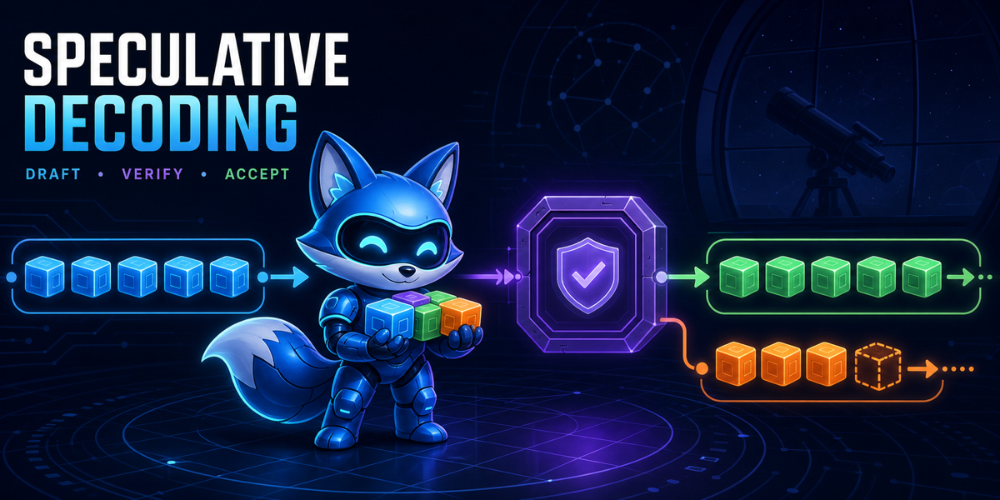

# Speculative Decoding Research

An open research kit for understanding and improving speculative decoding:
drafting, verification, correction, cache/state behavior, training, exactness,
acceptance, and end-to-end serving performance.

The repository is useful at two levels:

- **Playground:** small examples and scripts that make it easy to try an idea.
- **Lab archive:** experiments, literature notes, negative results, and compact
  evidence for work that needs to be reproduced or compared later.

Start with [`QUICKSTART.md`](QUICKSTART.md). The first example has no external
dependencies and demonstrates proposal, verification, rejection, correction,
and accepted-prefix accounting.

## What is here

| Path | Purpose |
|---|---|
| `examples/` | Small runnable demonstrations and teaching examples |
| `methods/` | Reusable method notes and implementations as they mature |
| `experiments/` | Experiment cards, plans, and reviews |
| `results/` | Cross-experiment summaries and current observations |
| `failures/` | Negative results and failed assumptions |
| `literature/`, `papers/` | Papers, source maps, and implementation notes |
| `models/`, `drafters/`, `runtimes/`, `hardware/` | Reproduction metadata |
| `receipts/` | Small machine-readable run records and hashes |
| `docs/` | Methods, taxonomy, roadmap, and release notes |
| `governance/` | Internal lab coordination and historical decisions |

Large models, datasets, checkpoints, GGUF files, feature tensors, and profiler
captures are intentionally kept outside Git. See [`AGENTS.md`](AGENTS.md).

## Current research

The first laboratory is Qwen3.8-27B with DFlash/DFlash2-style compact drafters,
alongside SmolLM experiments used to study capacity and latency trade-offs.
The current evidence shows that better teacher-forced metrics do not
automatically produce better acceptance or end-to-end speed. The repository
preserves that negative result instead of presenting an optimistic benchmark.

The latest Qwen export-format screen is summarized in
[`literature/HANDOFF-20260821-V30-RESULT.md`](literature/HANDOFF-20260821-V30-RESULT.md).
It is an approximate, screen-scoped result—not a general speed, quality, or
losslessness claim. The detailed internal decision and raw operational receipts
remain in the lab archive and are subject to the release boundary.

## Evidence vocabulary

Reports keep these observations separate:

1. construction and finite-gradient checks;
2. teacher-forced loss and token accuracy;
3. autoregressive draft acceptance;
4. output quality;
5. token/state exactness under a declared contract;
6. matched end-to-end latency and throughput;
7. generalization across models, workloads, hardware, and runtimes.

A result at one level does not imply the next level.

## Contributing

For a quick idea, add an example or experiment folder and record the command
and what happened. For a serious comparison, also record the model/runtime
identities, prompts or data split, baseline, and a compact receipt. Existing
templates under `templates/` are guides rather than a barrier to
experimentation.

See [`CONTRIBUTING.md`](CONTRIBUTING.md) and
[`docs/RELEASE-BOUNDARY.md`](docs/RELEASE-BOUNDARY.md) before preparing a
public release. The curated file list is in
[`PUBLIC-RELEASE-MANIFEST.md`](PUBLIC-RELEASE-MANIFEST.md).

## Current phase diagnostic

The current-65b8 EXP020 phase-pair receipt is a completed one-prompt,
instrumented, descriptive diagnostic: target-only reproduced its current
oracle, while Q4 n=1 diverged and exposed phase markers. The postrun critique
and [handoff](literature/HANDOFF-20260822-EXP020-65B8-PHASE-PAIR-POSTRUN.md)
classify it as diagnostic evidence only—no speed, exactness, acceptance,
verifier, or generalization claim is promoted.

## Status

This is a pre-1.0 research repository. APIs, scripts, and experiment formats
may change. Scientific claims should be read with their linked scope and
receipt, especially where a result is approximate, validation-only,
confounded, underpowered, or blocked.

## License and citation

Code and documentation are released under the [MIT License](LICENSE). To cite
the repository, use [`CITATION.cff`](CITATION.cff).
